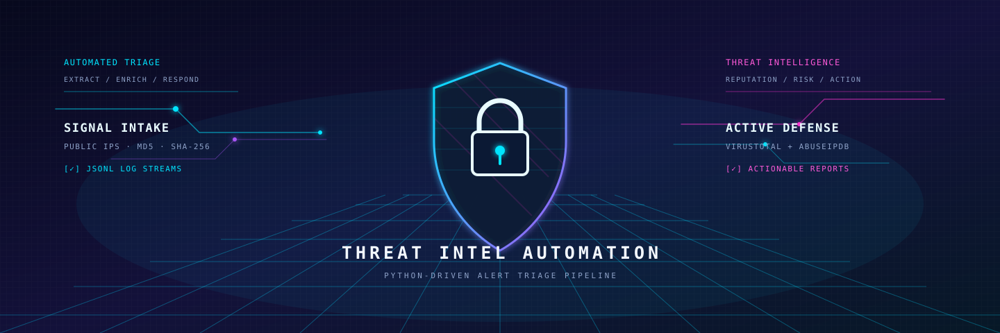

<div align="center">
  

  <h1>Python-Driven Alert Automation &amp; Threat Intel</h1>

  <p><strong>Turn raw security logs into prioritized, actionable threat-intelligence reports.</strong></p>

  <p><code>JSONL ingestion</code> · <code>IoC extraction</code> · <code>VirusTotal enrichment</code> · <code>AbuseIPDB context</code> · <code>CSV triage</code></p>
</div>

## Overview

This command-line pipeline ingests newline-delimited JSON security logs, identifies actionable indicators of compromise (IoCs), enriches them with external reputation data, and writes a focused CSV report for SOC triage.

Only non-benign indicators are included in the final report, helping analysts focus on the signals that warrant action.

## Workflow

```text
JSONL security logs
        │
        ▼
Extract public IPv4s, MD5 & SHA-256 hashes
        │
        ▼
Deduplicate IoCs and retain source timestamps/IDs
        │
        ├── VirusTotal reputation analysis
        └── AbuseIPDB IP-abuse context (optional)
        │
        ▼
Actionable CSV report: Block · Investigate
```

## Capabilities

- Streams JSONL logs line by line to keep ingestion memory-efficient.
- Extracts public IPv4 addresses, MD5 hashes, and SHA-256 hashes; private, loopback, and reserved IPv4 addresses are excluded.
- Deduplicates IoCs while preserving the timestamps or event IDs where they were observed.
- Enriches IPs and file hashes through the VirusTotal API, with retry, timeout, and rate-limit handling.
- Adds AbuseIPDB confidence and report-count context for IPs when an API key is supplied.
- Produces a timestamped CSV containing only IoCs with a non-zero VirusTotal malicious score.
- Maps the malicious score to a configurable `Block`, `Investigate`, or `Clean` disposition.

## Quick start

### 1. Set up Python and dependencies

Python 3.9+ is recommended.

```bash
python3 -m venv .venv
source .venv/bin/activate
pip install -r requirements.txt
```

### 2. Configure API credentials

Create a `.env` file in the project root:

```dotenv
# Required — used for IP and file-hash reputation lookups
VT_API_KEY=your_virustotal_api_key_here

# Optional — enables additional IP-abuse context
ABUSEIPDB_API_KEY=your_abuseipdb_api_key_here

# Optional — defaults to 3; scores at or above this threshold are marked Block
RISK_SCORE_THRESHOLD=3
```

Keep `.env` private. It is intentionally excluded from version control.

### 3. Run a triage pass

```bash
python main.py --input data/input_logs/
```

The repository includes `data/input_logs/sample_security_logs.json` as a JSONL-formatted example. To point the pipeline at another directory:

```bash
python main.py --input /path/to/security-logs
```

## Input format

The input directory may contain any number of `*.json` files. Each file must contain one complete JSON object per line (JSONL / NDJSON). The parser uses `timestamp`, then `id`, then the line number as the event context stored with an IoC.

```json
{"timestamp":"2026-10-02T10:01:15Z","event_type":"file_download","dst_ip":"1.1.1.1","file_hash":"44d88612fea8a8f36de82e1278abb02f","status":"blocked"}
```

IoCs can appear in any stringified part of the event. Supported indicator types are:

| Indicator | Handling |
| --- | --- |
| Public IPv4 | VirusTotal and, when configured, AbuseIPDB |
| MD5 | VirusTotal file lookup |
| SHA-256 | VirusTotal file lookup |

## Output and triage policy

When one or more enriched IoCs have a non-zero VirusTotal malicious score, a CSV is generated in `data/output_reports/` using the pattern `triage_report_YYYYMMDD_HHMMSS.csv`.

| VirusTotal malicious score | Disposition |
| --- | --- |
| `0` | Excluded from the report |
| `1` to `RISK_SCORE_THRESHOLD - 1` | `Investigate` |
| `>= RISK_SCORE_THRESHOLD` | `Block` |

The report includes the processing timestamp, IoC type and value, VirusTotal malicious score, required action, and source timestamps/IDs.

## Project structure

```text
.
├── assets/
│   └── cyberpunk-threat-intel.svg   # README banner artwork
├── core/
│   ├── ioc_extractor.py             # Indicator discovery and public-IP filtering
│   ├── log_parser.py                # Streaming JSONL ingestion and deduplication
│   └── report_builder.py            # Actionable CSV generation
├── integrations/
│   ├── abuseipdb.py                 # Optional IP-abuse enrichment
│   └── virustotal.py                # IP and file-hash reputation client
├── data/
│   └── input_logs/                  # Local sample/input logs (ignored by Git)
├── config.py                        # Environment validation and settings
├── main.py                          # Pipeline entry point
└── requirements.txt
```

## Operational notes

- A valid `VT_API_KEY` is required at startup. The pipeline exits before processing if it is absent or left as the placeholder.
- AbuseIPDB is gracefully skipped when `ABUSEIPDB_API_KEY` is not configured.
- VirusTotal requests are deliberately paced at 15 seconds between calls to respect the free-tier rate limit. Larger datasets can take time to complete.
- API failures for an individual indicator are logged and do not halt processing of the remaining IoCs.

## Disclaimer

This project prioritizes indicators using third-party reputation data; it does not make a final security decision. Validate findings against your environment, asset criticality, and incident-response process before taking containment action.
